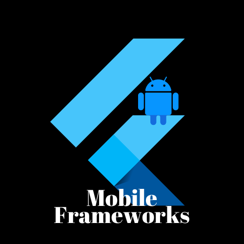

<h1 align="center"> Bonjour🤠, TANAY this side🙎‍♂️</h1>
<h3 align="center">An aspiring App Developer and a Tech Geek with a passion of learning new technologies</h3>

- 👨‍💻 I’m currently learning **Android/Flutter Development & Competitive Programming.**

- 📱 Currently doing projects on <i>**Android</i> as well as <i>Flutter**</i> . 

- 🦜 I am always up for **Hackathons and App Development project** collaborations.
 
- 📖 Ask me about anything **Android Development**  :) 

- 😜 Fun fact: **I Love watching Anime and playing Piano!!**

 

 

## 📊 GitHub Activity
|  |                                                                                                            |
| --------------------------------------------------------------------------------------------------------------------------------- | ----------------------------------------------------------------------------------------------------------------------------------------------------------------------------------------------------------------- |
|  |  |
|  | 

### 

|               |           |
|       ---     |    ---    |
| |    |
| |         |
| |    |
| |    |
| |   |
| |       |
| |                     |
| |      |

### 

 

### 
🎉 Welcome, to the world of Binary 🥂

