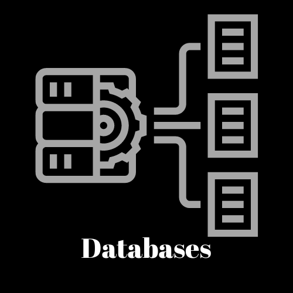

<h3 align="center">

</h3>
 

<h1 align="center"> 𝐻𝑒𝓁𝓁𝑜 𝒢𝓊𝓎𝓈!🤠, 𝒮𝒽𝓇𝑒𝓎 𝓉𝒽𝒾𝓈 𝓈𝒾𝒹𝑒 </h1>

<h3 align="center">

</h3>

<h3 align="center"> 𝓐𝓷 𝓪𝓼𝓹𝓲𝓻𝓲𝓷𝓰 𝓕𝓾𝓵𝓵-𝓢𝓽𝓪𝓬𝓴& 𝓜𝓛 𝓓𝓮𝓿𝓮𝓵𝓸𝓹𝓮𝓻. 𝓐 𝓣𝓮𝓬𝓱 𝓖𝓮𝓮𝓴 𝔀𝓲𝓽𝓱 𝓪 𝓹𝓪𝓼𝓼𝓲𝓸𝓷 𝓸𝓯 𝓵𝓮𝓪𝓻𝓷𝓲𝓷𝓰 𝓝𝓮𝔀 𝓣𝓮𝓬𝓱𝓷𝓸𝓵𝓸𝓰𝓲𝓮𝓼. </h3>

  

  

<h3 align="center">

</h3>

- 🔭 I’m currently working on **AI Generated Scripts Algorithms**👨‍

- 🌱 I’m currently learning **Microservices in Full-Stack**👀

- 👯 I’m looking to collaborate on **Web & ML Projects**⛳

- 💬 Ask me about **DSA, Web & Machine Learning Development**📱

- 🤖 I'm Co-Founder and Tech-Lead of **Insights Club at VIT**📖

- 🥅 2024 Goals: Contribute more to **Open Source projects**🥇

- 📫 You can reach me at **shrey.srivastava2101@gmail.com**🎃

- 😜 Fun fact: **Only Rehaan know's🎗Playing with 💖**

 

<h3 align="center">

</h3>

 

<h3 align="center">

</h3>

## ⚙ Coding Problems

<h3 align="center">

</h3>

## 📊 GitHub Activity

|  |                                                                                                            |
| --------------------------------------------------------------------------------------------------------------------------------- | ----------------------------------------------------------------------------------------------------------------------------------------------------------------------------------------------------------------- |
|  |  |
|  | 

<!-- color=nord_dark -->

<h3 align="center">

</h3>

## 📈 GitHub Contribution Graph

<h3 align="center">

</h3>

## 🏆 GitHub Trophies

 
<h3 align="center">

</h3>

<h3 align="center">

</h3>

### 

|               |           |
|       ---     |    ---    |
| |               |
| |    |
| |    |
| |    |
| |              |
| |         | 
| |       | 

<h3 align="center">

</h3>

### 

 

<h3 align="center">

</h3>

 

<h3 align="center">

</h3>

### 
🡠ğ–‚ğ–Šğ–‘ğ–ˆğ–”ğ–’ğ–Š ğ–™ğ–” ğ–™ğ–ğ–Š ğ–œğ–”ğ–—ğ–‘ğ–‰ ğ–”ğ–‹ ğ•®ğ–”ğ–‰ğ–ğ–“ğ–Œ! 👨â€ğŸ’»

<h3 align="center">

</h3>

<h2 align="center">☺𝑻𝒉𝒂𝒏𝒌 𝒚𝒐𝒖 𝒇𝒐𝒓 𝒗𝒊𝒔𝒊𝒕𝒊𝒏𝒈!💖</h2>

 
<h3 align="center">

</h3>
